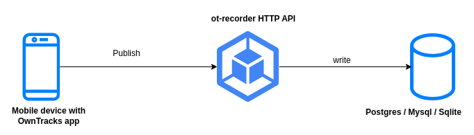
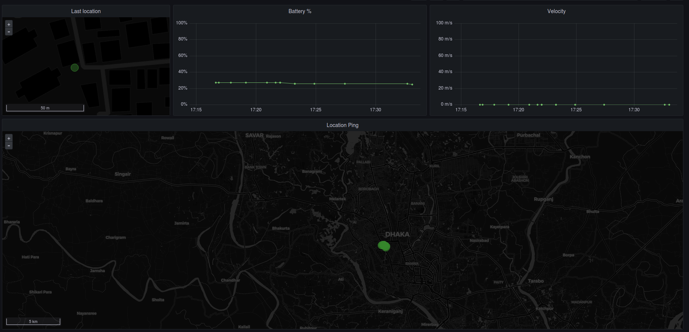

# OwnTracks Recorder
[](https://golang.org/doc/go1.19)
[](https://github.com/hrshadhin/ot-recorder/actions?query=workflow%3ABuild)
[](https://github.com/hrshadhin/ot-recorder/actions?query=workflow%3ASecurity)
[](https://codecov.io/gh/hrshadhin/ot-recorder)
[](https://goreportcard.com/report/github.com/hrshadhin/ot-recorder)

Store and access data published by OwnTracks apps in (PostgreSQL, MySQL or Sqlite) via REST API.
Self-hosted and Google-free location tracking system.

## Architecture


## Index
- [Architecture](#architecture)
- [System requirements](#system-requirements)
- [Getting started](#getting-started)
  - [Create Database and Users](#create-database-and-users)
  - [Configuration](#configuration)
  - [Deploy OwnTracks Recorder](#deploy-owntracks-recorder)
    - [Using Systemd.d service](#using-systemdd-service)
    - [Using Docker](#using-docker)
    - [Using Ansible](#ansible)
  - [Setup Mobile APP](#setup-mobile-app)
- [Grafana Integration](#grafana-integration)
- [Development](#development)
- [API's](#api)
- [Documentation](#docs)
- [TO-DO](#to-do)


## System requirements
- OwnTracks app (Android / iOS)
- PostgreSQL / MySQL / MariaDB / Sqlite
- Optional
  - Domain for public access
  - Reverse Proxy(NGINX/HA/Caddy) for TLS, HTTPS
  - Grafana visualization

## Getting started
### Create Database and Users
> For sqlite no need to create database or user.
- Create database `owntracks`
- Create a user for application(read/write)
- Create a user for grafana(read only)

### Configuration
- create a `config.yml` file or copy from `_doc/config.yml`
- customize the config
  ```yaml
  app:
    env: production
    host: localhost
    port: 8000
    read_timeout: 2s
    write_timeout: 5s
    idle_timeout: 3s
    context_timeout: 2s
    data_path: ./data # for sqlite | value must be /persist for docker
    time_zone: 'Asia/Dhaka'
    debug: false

  # For PostgreSQL
  database:
    type: postgres
    host: localhost
    port: 5432
    name: owntracks
    username: dev
    password: dev
    ssl_mode: disable
    max_open_conn: 1
    max_idle_conn: 1
    max_life_time: 10s
    debug: false

  # For MySQL or MariaDB
  #database:
  #  type: mysql
  #  host: localhost
  #  port: 3306
  #  name: owntracks
  #  username: dev
  #  password: dev
  #  max_open_conn: 1
  #  max_idle_conn: 1
  #  max_life_time: 10s
  #  debug: false

  # For Sqlite
  #database:
  # type: sqlite
  # name: owntracks
  # max_open_conn: 1
  # max_idle_conn: 1
  # max_life_time: 10s
  # debug: false
  ```
- NGINX config (Optional) [here](_deploy/nginx.conf)

### Deploy OwnTracks Recorder
#### Using Systemd.d service
- Download the binary from release page or build from source [Check here](#development)
- Move binary `mv ot-recorder /usr/local/bin/ot-recorder`
- It's assumed that your config file is located under `/opt/owntracks-recorder`
- Place this [owntracks-recorder.service](_deploy/owntracks-recorder.service) file into `/etc/systemd/system`
  ```
  [Unit]
  Description=Owntracks Recorder server
  Requires=network.target
  After=network.target

  [Service]
  Type=simple
  WorkingDirectory=/opt/owntracks-recorder
  ExecReload=/bin/kill -HUP $MAINPID
  ExecStart=/usr/local/bin/ot-recorder --config /opt/owntracks-recorder/config.yml serve

  Restart=always
  RestartSec=3

  [Install]
  WantedBy=multi-user.target
  ```
  Then run `sudo systemctl enable owntracks-recorder.service`
  Finally run `sudo systemctl start owntracks-recorder.service` to start and check status by
  running `sudo systemctl status owntracks-recorder.service`

#### Using Docker
- Docker compose
  ```bash
  # persistance data directory for sqlite
  mkdir data
  sudo chown -R 1000:1000 data
  ```
  ```yaml
  # _deploy/docker-compose.yml
  version: "3.5"

  services:
    owntracks-recorder:
      image: hrshadhin/ot-recorder
      container_name: owntracks-recorder
      restart: unless-stopped
      volumes:
        - ${PWD}/config.yml:/app/config.yml
        - ${PWD}/data:/persist # only for sqlite
      ports:
        - "8000:8000"
      environment:
        - TZ=Asia/Dhaka
  ```
  ```bash
  # run container in background
  docker-compose up -d

  # run migrations
  docker-compose exec owntracks-recorder /app/ot-recorder migrate up
  ```
- Docker CLI
  ```bash
  # run container in background
  docker run --name owntracks-recorder -p 8000:8000 \
      -v $(pwd)/config.yml:/app/config.yml \
      -v $(pwd)/data:/persist \
      hrshadhin/ot-recorder:latest

  # run migrations
  docker exec owntracks-recorder /app/ot-recorder migrate up
  ```
#### Ansible
- Ansible Role [here](https://github.com/hrshadhin/vps/tree/master/provisioner/ansible/roles/owntracks)

### Setup Mobile APP
- Install app [here](https://owntracks.org/)
- Configure APP
  ```yaml
  mode: HTTP

  endpoint:
  http://host[:port]/api/v1/ping #HTTP
  OR
  https://host[:port]/api/v1/ping # HTTPS/TLS
  OR
  http[s]://[user[:password]@]host[:port]/api/v1/ping # If basic auth enabled

  username: dev # <= 20 letter
  password: dev # set it, if basic auth enabled and endpoint dont have auth info
  device: phone # <= 20 letter
  trackingid: t1 # <= 2 letter
  ```

## Grafana Integration
- GeoMap Panel

- Queries
  ```sql
  -- Location pings
  SELECT
    to_timestamp(created_at) as "time", lat, lon,
    acc as accuracy, vel as velocity
  FROM locations
  WHERE
    $__unixEpochFilter(created_at)
  ORDER BY created_at

  -- Battery Level
  SELECT
    created_at as time, batt
  FROM locations
  WHERE
    $__unixEpochFilter(created_at)
  ORDER BY created_at

  -- Velocity
  SELECT
    created_at as time, vel
  FROM locations
  WHERE
    $__unixEpochFilter(created_at)
  ORDER BY created_at

  -- Last Location
  SELECT
    to_timestamp(created_at) as "time",
    lat, lon, acc as accuracy, vel as velocity
  FROM locations
  ORDER BY created_at DESC
  LIMIT 1
  ```
- [Dashboard Json](_doc/grafana-dashboard.json)

## Development
- Copy config file `mv _doc/config ./` to root directory and change it
- Local
  ```bash
  make build # build binary
  make version # check binary
  make serve # run the application
  make migrate-up
  make test-unit
  make test-integration # default sqlite
  make test-integration-mysql
  make test-integration-pgsql
  make help # Get all make command
  ```
- Docker
  ```bash
    make docker-build
    make docker-run
    # migrate
    make docker-migrate
  ```
- Visit **`http://localhost:8000`**
- Stop `CTRL + C`
- About [OwnTracks](https://owntracks.org/)

## API
- Location Ping
- User Last Location

## Docs
- [ERD](_doc/erd.png)
- [API documentation](https://hrshadhin.github.io/projects/ot-recorder/swagger.html)

## TO-Do
- [ ] Telegram Bot for last location check
- [ ] Reverse geocoding
